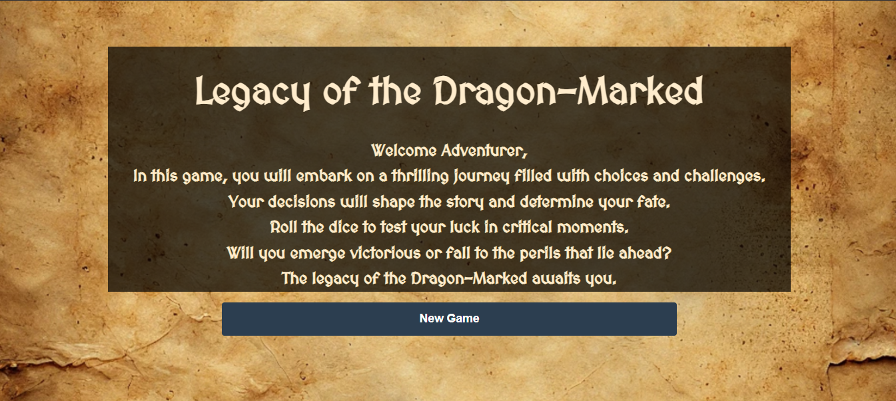

# Legacy of the Dragon Marked

## Description
Legacy of the Dragon Marked is an immersive text-based adventure game where players navigate through a rich fantasy world. Make crucial decisions that affect your destiny, engage in combat decided by dice rolls, and uncover the ancient mysteries of the dragon marks.

## Getting Started
🎮 [Play the Game](https://fares-yusuf.github.io/legacy-of-the-dragon-marked/)  
📋 [Trello Board](https://trello.com/b/NBs8qrFU/dnd-ga-project-1)

### Installation
1. Clone the repository
2. Open index.html in your browser
3. Begin your adventure!

## Technologies Used
- HTML5
- CSS3
- JavaScript
- Local Storage for game saves
- Responsive Design
- CSS Flexbox

## Features
- Branching narrative paths
- Character progression system
- Dynamic combat encounters
- Inventory management
- Save/Load functionality
- Atmospheric backgrounds

## Attributions
- Google and ChatGPT for Images

## Next Steps
- Soundtracks and Sound Effects
- Multiple character classes
- Achievement system
- Additional storylines and quests